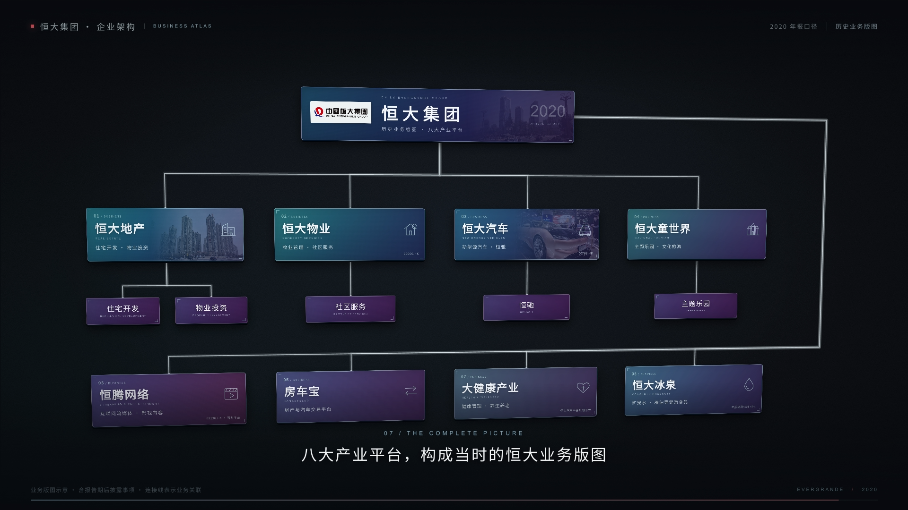
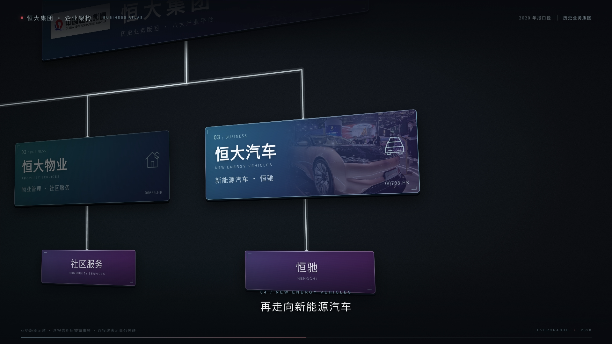

# 恒大历史业务版图 · 深色企业架构

以恒大集团 2020 年报披露的八大产业平台为示例，用深色渐变卡片、细线和逐段推进的镜头讲解企业业务关系。适合企业版图、组织关系、产品矩阵和系统架构说明。

**风格关联：[S02 深色商务](../../styles.md#s02)＋[S04 线性科技](../../styles.md#s04)。** 深色商务组织标题、品牌与业务信息，线性科技通过节点和连线说明结构。3D 镜头巡游是运动方式，企业架构是用途；共面的图文卡片构成 2.5D 信息图，不另建风格分类。

## 预览与源码





- [完整源码目录](source/)：原始 TypeScript/React、CSS、VMG 文档、关键帧、依赖锁文件、图片和字体原件。
- 这两张图分别由本案例源码在 **14.3 秒和 7.5 秒**通过 VMG Renderer 渲染。它们是指定时刻的静态图；完整运动请打开工程播放。
- [预览与源码对应记录](verification.json)记录源码/素材清单哈希、预览时间和实际执行范围。
- 本案例提供源码目录，不用 `.vmgc` 或成片替代源码。可按下面的命令自行打包成 `.vmg`。

## 画面与运动

全片 15 秒：先展示集团，再进入地产与业务细分，横移经过物业、汽车和文旅，随后展示其余产业，最后拉远到整张版图。白色连线与卡片依次显现。

全部 14 张卡片及其连接线共用 `Z=0` 平面，卡片没有独立的深度入场动画。摄影机对整张图做平移、推进、环绕、俯仰和轻微滚转，卡片与连线保持同一套透视。镜头旋转会让整个平面倾斜；需要正面视图时，将水平环绕、俯仰和滚转角设为 0。

## 打开与改作

下载本仓库 ZIP 并解压，或克隆后进入源码目录。已验证的配套环境是 **VMG CLI 0.0.7＋SDK 0.0.7**；不要直接替换已有全局版本，新版本兼容性需另行确认。

```sh
git clone https://github.com/VibeMG/awesome-vmg.git
cd awesome-vmg/projects/evergrande-business-atlas/source
pnpm install --frozen-lockfile
pnpm run typecheck
vmg doctor .
vmg dev .
```

打开 `vmg dev` 输出的本地地址即可播放、修改与保存。改作后可打包：

```sh
vmg pack . -o ../business-atlas-edited.vmg --assets include
vmg build . -o ../business-atlas-edited.vmgc --assets include
```

### 将示例换成自己的企业

1. 在标准面板“标题与时期”修改标题、资料时期、页脚品牌、年份和口径说明。
2. 在“产业平台”选择集团主卡，替换中文名、英文名、说明、年份标签及标志。标志可以清空，主卡标题会使用腾出的空间。
3. 逐个替换产业名称、英文、业务说明、注记与实景图片。不要只改集团名而保留恒大的历史业务内容。
4. 在 PRO 面板调整分支卡片、连接线和字幕。连接线用起终点图层 ID 跟随卡片；同一平面布局时保持各卡片深度与水平旋转为 0。
5. 在摄影机图层调整目标 X/Y、距离、环绕和俯仰关键帧，使镜头对应新内容的位置和讲解顺序。

卡片数量和布局可在工程中继续修改，当前八平台只是示例。增加或删除卡片时同步处理相应连线、字幕与镜头轨道。

### 给 Agent 的实现入口

| 要改的内容 | 入口 |
| --- | --- |
| 文字、素材绑定、位置和关键帧 | `source/project.vmg.json`，运行时优先使用 VMG Agent 事务 |
| 3D 摄影机、连线投影、卡片与字幕 | `source/src/index.tsx` |
| 渐变、边框、排版、颗粒与遮光 | `source/src/scene.css` |
| 标准编辑器字段 | `source/src/standard.ts` |
| 原件绑定与素材 | `source/.vmg/resources.json`、`source/.vmg/originals/`，替换素材使用 VMG 导入流程 |

`camera-3d` 是自定义摄影机组件；`group` 是集团主卡；`estate`、`property`、`auto`、`tourism`、`network`、`fcb`、`health`、`water` 是八个平台；`edge-*` 是连接线，`caption-*` 是字幕。

摄影机投影与场景合成由源码实现，VMG 提供文档、属性轨道求值、编辑面板、素材与字体管理、保存和渲染。各卡片是独立 VMG 数据图层，但由摄影机组件统一绘制；**透视后的画布选框与直接拖动尚未接入**，请通过标准面板或图层/属性面板编辑。

## 工程与版本

| 项目 | 记录 |
| --- | --- |
| 案例版本 | `1.0.0` |
| 画布与时间 | 1920×1080，30fps，15秒 |
| CLI / SDK | `0.0.7` / `0.0.7` |
| 依赖 | React / React DOM 19.2.8，TypeScript 5.9.3，pnpm 10.34.5 |
| 文档 | schema 2.0，39 个节点，46 条轨道，210 个关键帧 |
| 素材 | 4 张图片原件、1 份 Noto Sans SC 字体 |
| 实现来源 | 本案例保留原始 TypeScript/React 源码，不是从编译运行包反推的源码 |

本次收录把主卡英文、年份与说明、页脚品牌和年份改为持久化字段，并允许清空集团标志。保留已保存的动画与共面布局，去掉作者机器的绝对路径及本地服务信息。

## 资料口径与许可

恒大内容依据《2020 年年报》，含报告期后披露事项。连接线表示业务关联，不能用作当前法人股权结构。大健康保留与恒大汽车平台的关系说明，恒大冰泉保留年报披露的 49% 持股注记。

原创工程代码与本次说明采用仓库的 [Apache-2.0](../../LICENSE)。三张照片及其渲染改编/预览保持 **CC BY-SA 4.0**；Noto Sans SC 遵循 **SIL OFL 1.1**；标志保留商标权。作者、原图链接、处理方式和资料出处均见 [SOURCES.md](SOURCES.md)，字体许可见 [OFL-NotoSansSC.txt](OFL-NotoSansSC.txt)。这些素材不统一改为 Apache-2.0。

原参考视频仅用于观察镜头与节奏，其画面、声音和人像没有随案例再分发。改作其他企业时请同步替换品牌、内容和素材，并保留所用素材的署名与许可。

## 本次运行记录

在 macOS Apple Silicon 上执行依赖安装、类型检查、VMG doctor、编辑器打开、指定时刻 PNG 渲染、源码打包和编译构建；另外对源码包做 CLI 解包并比较工程与源码文件。新增字段通过一次编辑和撤销确认保存链路。静态预览与源码版本记录见 `verification.json`。

没有生成视频成片，也未验证其他操作系统或后续 CLI 版本的兼容性。
