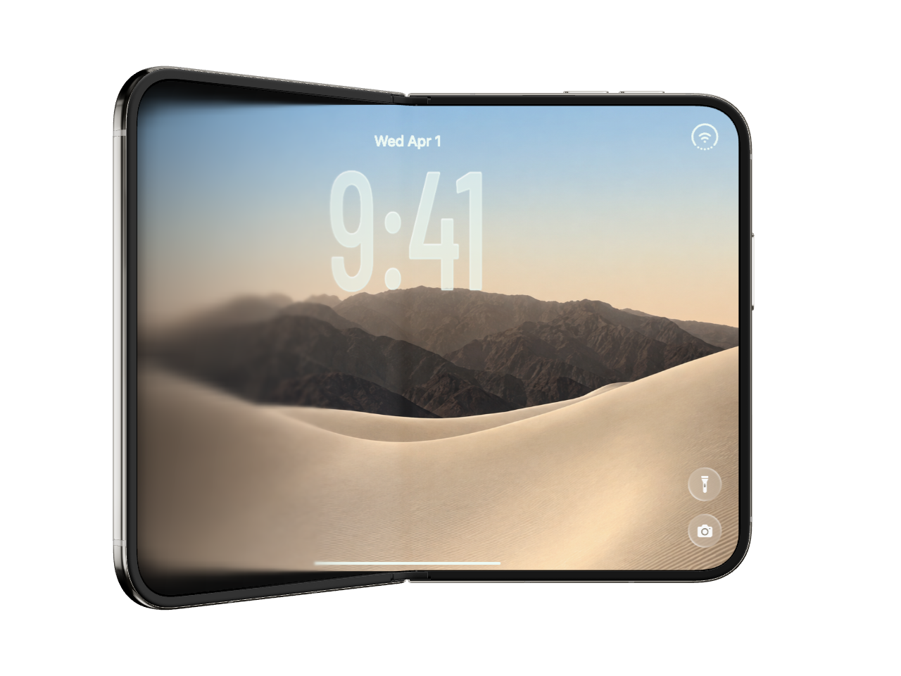

# Duo展开2D · 双屏设备案例

双屏设备展开的特殊用途案例，适合折叠屏、内外屏壁纸和界面展示。保留独立工程入口，`style_ids`为空，不用手机题材或局部玻璃效果替它指定整体风格。

可编辑：共用或独立内外屏壁纸、锁屏时间和日期、文字外观、壁纸构图与缩放、快捷按钮、工程数据及展开时间轴。

上传工程为1.5.0。Duo仓库9月17日的背景与开关更新对应2D模板1.6.0、CLI/SDK 0.0.7，不包含在本次包内；不把那份新版VMGC标为本工程的同版本预览。

## 预览与源码



- [下载完整源码包](iphone-duo-unfold-2d.vmg)（GitHub文件页选择下载原始文件）。
- 本图直接取自同一上传包的`preview.png`素材，未在本次重新渲染；不能据此证明当前源码与图片逐帧一致。
- 源码包SHA-256：`79c7bad681bcea9a8670753ad2e85733f4ec50bba75702508d84defcb835281f`。
- 上游：[moubit/vmg-duo](https://github.com/moubit/vmg-duo/tree/59d7688e3bacc693f71db8173b7879138dedd7f3)。本次源码由作者上传，以包内版本为准。

## 工程与版本

| 项目 | 记录 |
| --- | --- |
| 模板版本 | `1.5.0` |
| 画布与时间 | 1280×960，30fps，8秒 |
| SDK依赖 | `@base_bit/vmg-sdk@0.0.6`，依赖及锁文件一致 |
| CLI制作版本 | 上传包未记录，不能从SDK版本反推；需用支持此工程契约的CLI验证 |
| 其他依赖 | React/React DOM 19.2.8、TypeScript 5.9.3、pnpm 10.33.0 |
| 工程契约 | `vmg-project`格式1、工程schema 2.0、`vmg.react`契约5、`react-v1`构建配置 |

## 打开和改作

Agent 改作时可按需读取 [模板 Skill](iphone-duo-unfold-2d_vmgskill.md)，了解内外屏素材、锁屏内容、展开节奏与投影关系。指南对应本页记录的源码包版本。

将源码包下载到本地，使用支持上述契约的VMG CLI解包为新目录。源码包中的资源绑定由CLI恢复，不要仅把ZIP内容解压后当成完整工作目录。

```sh
vmg unpack iphone-duo-unfold-2d.vmg --out iphone-duo-unfold-2d-edit
cd iphone-duo-unfold-2d-edit
pnpm install --frozen-lockfile
pnpm run typecheck
vmg doctor .
vmg dev .
vmg pack . -o ../iphone-duo-unfold-2d-edited.vmg --assets include
vmg build . -o ../iphone-duo-unfold-2d-edited.vmgc --assets include
```

`.vmg`保留可修改实现、工程与素材；`.vmgc`用于编译预览。浏览器静态编辑器不能代替源码解包和构建。上述为使用步骤，本次未在VMG CLI中实际执行。

## 源码边界与来源

这是从已交付运行包恢复的可编辑源码工程，含`src/entry.tsx`、组件/效果/编辑器声明、`src/recovered/implementation.js`、CSS、`project.vmg.json`、依赖和锁文件。

恢复的JavaScript是实际作者实现，但不等同于找回原始TypeScript：原始类型注解、局部变量名和模块拆分未完整恢复。包内`docs/恢复来源.json.txt`保留具体记录。源运行包SHA-256为`5362e34b00a0063d9e723a4ed0f1523b885187470438639b922a6f6feaa348b5`；这条记录不代表该历史运行包已在本库提供。

## 素材与许可

包内保留设备外框/遮罩二进制、壁纸、BarlowCondensed-Medium字体、参考截图及原有预览图，共5个素材。原包逐字节保留。本库Apache-2.0许可覆盖新增目录说明与校验脚本，不自动改变上传工程、字体、图片或设备素材的许可。上传包未附独立LICENSE或完整素材授权说明；复用与再分发前需核对作者及第三方授权，不能把包内素材统一视为Apache-2.0。原包没有提供的许可文件，本次不补造。

## 本次核验范围

已核对源码清单、入口、工程及依赖文件、包内每个文件的大小与SHA-256、素材原件和项目引用，查看了包内静态预览。未执行依赖安装、类型检查、CLI解包/构建、浏览器编辑或视频导出，因此不标记为运行验收通过。
