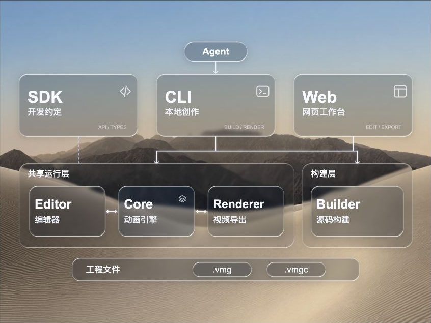

# 原生AI工作流 · 液态玻璃架构演示

液态玻璃的完整工程参考。背景图穿过半透明卡片和外层分区，细线表达SDK、CLI、Web、Editor、Core等模块关系。适合技术架构、工具工作流和模块说明。

关联方向：[S08柔光科技](../../styles.md#s08)、[S04线性科技](../../styles.md#s04)。液态玻璃是材料表达，不新增顶层风格。

可编辑：模块名称和标签、卡片玻璃柔化/折射/高光/着色、分区玻璃、背景壁纸与遮光、工程数据及时间轴。

## 预览与源码



- [下载完整源码包](native-ai-flow.vmg)（GitHub文件页选择下载原始文件）。
- 本图直接取自同一上传包的`preview.png`素材，未在本次重新渲染；不能据此证明当前源码与图片逐帧一致。
- 源码包SHA-256：`05a21d58f7b22b0b59e3cd823172c778885b09b06095cacb22921b3dacf6ff64`。
- 上游：[moubit/vmg-duo](https://github.com/moubit/vmg-duo/tree/59d7688e3bacc693f71db8173b7879138dedd7f3)。本次源码由作者上传，以包内版本为准。

## 工程与版本

| 项目 | 记录 |
| --- | --- |
| 模板版本 | `1.8.0` |
| 画布与时间 | 1600×1200，30fps，9秒 |
| SDK依赖 | `@base_bit/vmg-sdk@0.0.6`，依赖及锁文件一致 |
| CLI制作版本 | 上传包未记录，不能从SDK版本反推；需用支持此工程契约的CLI验证 |
| 其他依赖 | React/React DOM 19.2.8、TypeScript 5.9.3、pnpm 10.33.0 |
| 工程契约 | `vmg-project`格式1、工程schema 2.0、`vmg.react`契约5、`react-v1`构建配置 |

## 打开和改作

Agent 改作时可按需读取 [模板 Skill](native-ai-flow_vmgskill.md)，了解具体节点、玻璃参数、连线与时间轴的修改方式。指南对应本页记录的源码包版本。

将源码包下载到本地，使用支持上述契约的VMG CLI解包为新目录。源码包中的资源绑定由CLI恢复，不要仅把ZIP内容解压后当成完整工作目录。

```sh
vmg unpack native-ai-flow.vmg --out native-ai-flow-edit
cd native-ai-flow-edit
pnpm install --frozen-lockfile
pnpm run typecheck
vmg doctor .
vmg dev .
vmg pack . -o ../native-ai-flow-edited.vmg --assets include
vmg build . -o ../native-ai-flow-edited.vmgc --assets include
```

`.vmg`保留可修改实现、工程与素材；`.vmgc`用于编译预览。浏览器静态编辑器不能代替源码解包和构建。上述为使用步骤，本次未在VMG CLI中实际执行。

## 源码边界与来源

这是从已交付运行包恢复的可编辑源码工程，含`src/entry.tsx`、组件/效果/编辑器声明、`src/recovered/implementation.js`、CSS、`project.vmg.json`、依赖和锁文件。

恢复的JavaScript是实际作者实现，但不等同于找回原始TypeScript：原始类型注解、局部变量名和模块拆分未完整恢复。包内`docs/恢复来源.json.txt`保留具体记录。源运行包SHA-256为`84613803431d6d699aa1f0643a30d210cc5d878b4ef1466761de677d7779ecb1`；这条记录不代表该历史运行包已在本库提供。

## 素材与许可

包内保留背景壁纸及原有预览图，共2个素材。原包逐字节保留。本库Apache-2.0许可覆盖新增目录说明与校验脚本，不自动改变上传工程、字体、图片或设备素材的许可。上传包未附独立LICENSE或完整素材授权说明；复用与再分发前需核对作者及第三方授权，不能把包内素材统一视为Apache-2.0。原包没有提供的许可文件，本次不补造。

## 本次核验范围

已核对源码清单、入口、工程及依赖文件、包内每个文件的大小与SHA-256、素材原件和项目引用，查看了包内静态预览。未执行依赖安装、类型检查、CLI解包/构建、浏览器编辑或视频导出，因此不标记为运行验收通过。
