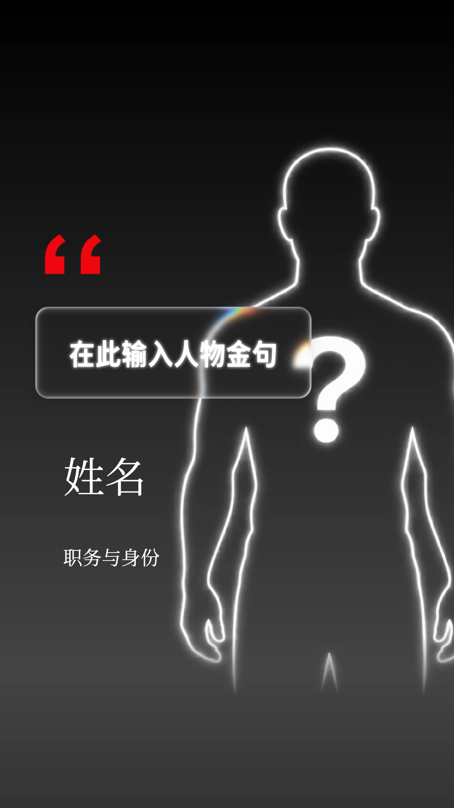

# 人物金句 · 液态玻璃

用于人物介绍、访谈摘句和观点展示的完整 VMG 模板。人物以透明底白色发光轮廓和问号占位，姓名、身份和金句均为通用占位文字。

分类关联：[S02 深色商务](../../styles.md#s02)、[S08 柔光科技](../../styles.md#s08)。深色背景组织人物与文字，液态玻璃提供半透明材质和柔化高光。



## 下载与打开

- [完整源码包 portrait-quote-glass.vmg](https://github.com/VibeMG/awesome-vmg/releases/download/portrait-quote-glass-v1.0.0/portrait-quote-glass.vmg)
- [可导入的编译模板 portrait-quote-glass.vmgc](https://github.com/VibeMG/awesome-vmg/releases/download/portrait-quote-glass-v1.0.0/portrait-quote-glass.vmgc)
- [透明人物占位图 PNG](https://github.com/VibeMG/awesome-vmg/releases/download/portrait-quote-glass-v1.0.0/unknown-person-transparent.png)
- [发布记录与校验值](https://github.com/VibeMG/awesome-vmg/releases/tag/portrait-quote-glass-v1.0.0)

源码包包括 TypeScript/React、项目数据、标准模式设置、依赖与锁文件、字体及占位图。使用 VMG CLI 0.0.7 解包后编辑：

```sh
vmg unpack portrait-quote-glass.vmg --out portrait-quote-glass-edit
cd portrait-quote-glass-edit
pnpm install --frozen-lockfile
pnpm run typecheck
vmg dev .
```

`.vmgc`可导入兼容的 VMG 编辑器，保留标准模式和工程数据编辑。需要修改组件实现时使用`.vmg`源码包。

## 可编辑范围

标准模式可直接替换人物图片、姓名、身份和金句。卡片尺寸跟随文字、字体、字号、换行和内边距变化，也支持手动宽高。

人物可调整位置、比例、裁切、颜色和底部渐隐；渐隐范围与强度均为0–100%。背景可切换为图片，支持显示方式、缩放、位置和不透明度。

玻璃可调厚度、折射、柔化、色散、高光、扫光、反光、着色和阴影。边缘色散默认8，圆角独立控制。

线条沿路径绘制到卡片宽度后，再扩展为玻璃。展开按实际几何尺寸计算，圆角不会随入场缩放拉伸。人物、署名、引号与卡片各有轻微漂移，PRO模式保留15个图层和20条关键帧轨道。

## 版本与制作记录

| 项目 | 记录 |
| --- | --- |
| 发布版本 | 1.0.0 |
| 画布与时间 | 1080×1920，60fps，6.3秒 |
| CLI / SDK | 0.0.7 / `@base_bit/vmg-sdk@0.0.7` |
| 构建方式 | 标准 Node / TypeScript / React，`react-v1` |
| 素材 | 1张生成的人物占位图、3份字体文件 |
| 预览 | 本发布工程5.5秒处的1080×1920 PNG静帧 |

发布前完成了类型检查、CLI编译、源码包还原与素材字节比对，以及本地编辑器中的播放和PNG渲染。标准模式的自动尺寸、图片背景、人物渐隐和玻璃厚度已在制作时运行检查；未导出MP4。

## 来源与许可

占位图通过内置imagegen全新生成并去除背景，没有使用真人照片作为输入。轮廓内外均为真实透明Alpha，白色轮廓与问号保留半透明光晕，可叠在不同底图上。生成提示词和校验值记录在源码包的`src/assets-provenance.json`。工程的默认文字、元数据和预览均使用通用内容。

未来荧黑与思源宋体随包附带OFL许可证，位于`src/licenses/`。使用这些字体时保留各自许可。

液态玻璃基于本库[原生AI工作流](../native-ai-flow/README.md)的实现，扩展了自适应布局和厚度控制；来源记录位于`src/glass-provenance.json`。本条目由作者提供并授权上传；本库对索引和说明的Apache-2.0许可不改授上游实现或字体的权利。
